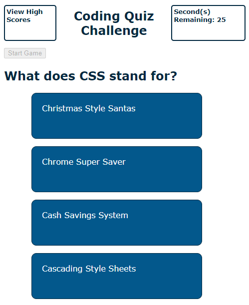

Homework Assignment - 04 Web APIs: Code Quiz

## Description
The focus of this homework assignment for the University of Toronto SCS Coding Boot Camp was to create a multiple-choice coding quiz using web APIs. The app runs in the browser and features dynamically updated HTML and CSS powered by JavaScript code that I wrote.

## Key Features
- Quiz includes a countdown timer using the setInterval() & clearInterval() methods
- User's score is based on the time remaining at the end of the quiz, which is decreased when user selects a wrong answer
- Event listeners are used to start the game, view high scores, select a quiz question answer, and submit initials for the high scores
- User can view initials of past players and their scores which have been saved in localStorage with the help of JSON to deal with strings and objects
- Sections are displayed or hidden as needed through use of setAttribute method
- Questions and answers are rendered based on an array of objects in the main JavaScript file with the HTML being updated dynamically
- CSS variables are used for colors referenced in the style sheet for ease of future colour scheme updates

## Link
Website can be found here: https://darylnauman.github.io/code-quiz/

## Screenshot
The following image shows a snapshot of a portion of the webpage:

